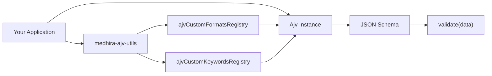

<p align="center">
  
</p>

<p align="center">
  <strong>Engineering Intelligence Across Everything</strong>
</p>

<p align="center">
  <a href="https://www.npmjs.com/package/medhira-ajv-utils"></a>
  <a href="https://www.npmjs.com/package/medhira-ajv-utils"></a>
  <a href="https://nodejs.org/"></a>
  <a href="https://medhira-ajv-utils.readthedocs.io/"></a>
</p>

<h1 align="center">medhira-ajv-utils</h1>

<p align="center">
  Custom <strong>AJV</strong> formats and keywords for precise JSON Schema validation — India business identifiers, UUID, ISO durations, UTC timestamps, and decimal precision control.
</p>

---

## Why MEDHIRA AJV Utils?

Modern APIs need validation that goes beyond built-in JSON Schema types. **medhira-ajv-utils** extends AJV with production-ready formats and keywords so your schemas stay declarative and your application code stays clean.

| | |
|---|---|
| **Ready-to-use formats** | UUID, UTC timestamps, ISO 8601 durations, India-specific IDs |
| **Custom keywords** | `decimalPrecision` for currency and numeric string rules |
| **TypeScript-first** | Full type definitions shipped with the package |
| **Zero runtime dependencies** | Pure validation logic — only AJV peer deps required |

---

## Installation

```bash
npm install medhira-ajv-utils ajv ajv-formats ajv-errors
```

```bash
yarn add medhira-ajv-utils ajv ajv-formats ajv-errors
```

**Requirements:** Node.js 18+

---

## Quick Start

```js
import Ajv from 'ajv';
import ajvErrors from 'ajv-errors';
import ajvFormats from 'ajv-formats';
import { ajvCustomFormatsRegistry, ajvCustomKeywordsRegistry } from 'medhira-ajv-utils';

const ajv = new Ajv({ allErrors: true });

ajvErrors(ajv);
ajvFormats(ajv);
ajvCustomFormatsRegistry(ajv);
ajvCustomKeywordsRegistry(ajv);

const schema = {
  type: 'object',
  required: ['id', 'pan', 'amount'],
  properties: {
    id: { type: 'string', format: 'uuid' },
    pan: { type: 'string', format: 'india-PAN' },
    ifsc: { type: 'string', format: 'india-IFSC' },
    pincode: { type: 'string', format: 'india-pincode' },
    amount: { type: 'number', decimalPrecision: 2 },
  },
};

const validate = ajv.compile(schema);

const valid = validate({
  id: 'e3ced088-62a2-418b-bda1-d114a37badb3',
  pan: 'HNEPS8362B',
  ifsc: 'SBIN0001234',
  pincode: '516501',
  amount: 1500.5,
});

console.log('Valid:', valid);
```

---

## Architecture



---

## Available Formats

| Format | Description | Valid Example | Invalid Example |
|--------|-------------|---------------|-----------------|
| `uuid` | UUID (v1–v5) | `e3ced088-62a2-418b-bda1-d114a37badb3` | `e3ced088-62a2-418b-bda1-d114a` |
| `india-PAN` | Indian PAN (10 chars) | `HNEPS8362B` | `PT12H` |
| `india-Personal-PAN` | Personal PAN (4th char `P`) | `AAAPA1234A` | `HNEPS8362B` |
| `india-IFSC` | Indian IFSC code | `SBIN0001234` | `PT12H` |
| `india-pincode` | 6-digit PIN code | `516501` | `1234` |
| `udyam` | Udyam registration ID | `UDYAM-MH-12-1234567` | `Udyam-12-34-1234567` |
| `positive-number-in-string` | Non-negative number as string | `123`, `0`, `999.99` | `-123`, `abc` |
| `utc-date-time` | UTC ISO 8601 timestamp | `2024-09-21T14:30:00Z` | `12/09/2023` |
| `iso8601-duration` | ISO 8601 duration | `P13D`, `PT12H` | `12 hours` |

<details>
<summary><strong>Format details & schema snippets</strong></summary>

### uuid

```json
{ "type": "string", "format": "uuid" }
```

### india-PAN

```json
{ "type": "string", "format": "india-PAN" }
```

### india-Personal-PAN

```json
{ "type": "string", "format": "india-Personal-PAN" }
```

### india-IFSC

```json
{ "type": "string", "format": "india-IFSC" }
```

### india-pincode

```json
{ "type": "string", "format": "india-pincode" }
```

### udyam

```json
{ "type": "string", "format": "udyam" }
```

Format: `UDYAM-XX-YY-ZZZZZZZ` — `XX` = 2-letter state code, `YY` = 2-digit district code, `ZZZZZZZ` = 7-digit registration number.

### positive-number-in-string

```json
{ "type": "string", "format": "positive-number-in-string" }
```

### utc-date-time

```json
{ "type": "string", "format": "utc-date-time" }
```

Accepts timestamps with or without milliseconds (e.g. `2024-09-21T14:30:00Z` or `2024-09-21T14:30:00.000Z`).

### iso8601-duration

```json
{ "type": "string", "format": "iso8601-duration" }
```

</details>

---

## Keywords

### decimalPrecision

Enforces a maximum number of decimal places on `number` or numeric `string` values.

```json
{
  "price": { "type": "number", "decimalPrecision": 2 }
}
```

| Value | `decimalPrecision: 2` |
|-------|----------------------|
| `2`, `2.11`, `"2.11"` | Valid |
| `2.123`, `"2.123"`, `"2.123a"` | Invalid |

---

## Documentation

Full guides, API reference, and contributing docs:

**[https://medhira-ajv-utils.readthedocs.io/](https://medhira-ajv-utils.readthedocs.io/)**

---

## Public API

This package intentionally exposes only two entry points:

| Export | Description |
|--------|-------------|
| `ajvCustomFormatsRegistry(ajv)` | Registers all custom formats on an AJV instance |
| `ajvCustomKeywordsRegistry(ajv)` | Registers all custom keywords on an AJV instance |

Individual format and keyword modules are internal implementation details.

---

## Contributing

Contributions are welcome! See [Contributing Guide](https://medhira-ajv-utils.readthedocs.io/en/latest/about/contributing/) or open an issue on GitHub.

1. Fork the repository
2. Create a feature branch
3. Add tests and update docs
4. Submit a pull request

---

## Sponsor & Support

To keep this library maintained and up-to-date, please consider sponsoring it on GitHub.

For private support or customization, reach out at **hello.medhira@gmail.com**

---

## About MEDHIRA

**MEDHIRA** — Engineering Intelligence Across Everything

- Website: [medhira.readthedocs.io](https://medhira.readthedocs.io/en/latest/)
- GitHub: [HELLOMEDHIRA](https://github.com/HELLOMEDHIRA)
- Email: hello.medhira@gmail.com

---

## License

[Apache-2.0](LICENSE)

<p align="center"><sub>Made with passion by MEDHIRA</sub></p>
