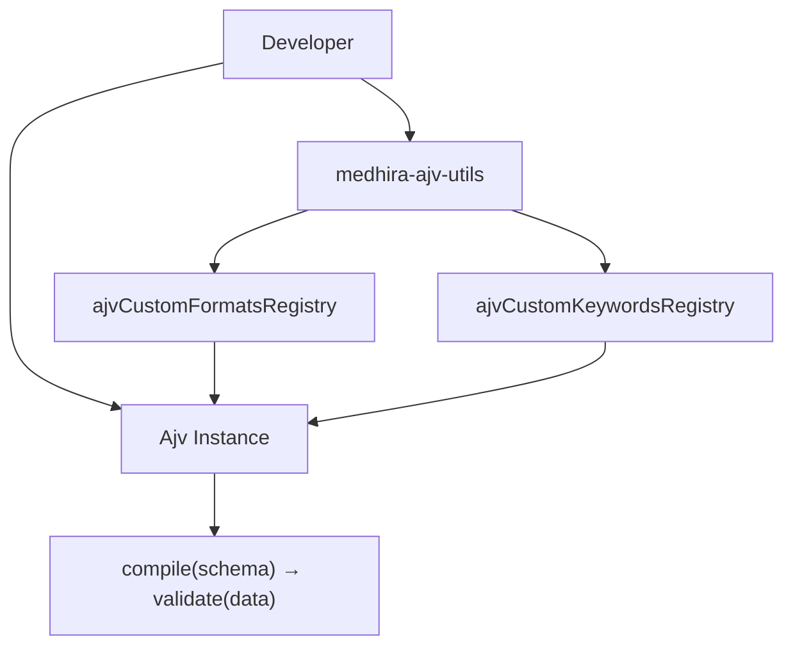

<p align="center">
  
</p>

<p align="center">
  <strong>Engineering Intelligence Across Everything</strong>
</p>

---

MEDHIRA AJV Utils extends [AJV](https://ajv.js.org/) (Another JSON Schema Validator) with custom formats and keywords for precise, declarative validation.

!!! note "Peer dependencies"
    Install **ajv**, **ajv-formats**, and **ajv-errors** alongside this package.

## Why MEDHIRA?

| Feature | Description |
|---------|-------------|
| **Ready-to-use formats** | UUID, UTC timestamps, ISO durations, India business IDs |
| **Custom keywords** | `decimalPrecision` for currency and numeric strings |
| **TypeScript support** | Type definitions included |
| **Zero runtime dependencies** | Pure validation logic — only AJV peer deps required |

## Architecture



## Quick Example

```js
import Ajv from 'ajv';
import ajvErrors from 'ajv-errors';
import ajvFormats from 'ajv-formats';
import { ajvCustomFormatsRegistry, ajvCustomKeywordsRegistry } from 'medhira-ajv-utils';

const ajv = new Ajv({ allErrors: true });
ajvErrors(ajv);
ajvFormats(ajv);
ajvCustomFormatsRegistry(ajv);
ajvCustomKeywordsRegistry(ajv);

const schema = {
  type: 'object',
  properties: {
    id: { type: 'string', format: 'uuid' },
    pan: { type: 'string', format: 'india-PAN' },
    price: { type: 'number', decimalPrecision: 2 },
  },
};

const validate = ajv.compile(schema);
```

## Sponsor & Support

To keep this library maintained and up-to-date, please consider sponsoring it on GitHub.

For private support, reach out at **hello.medhira@gmail.com**

---

**MEDHIRA** — Engineering Intelligence Across Everything
